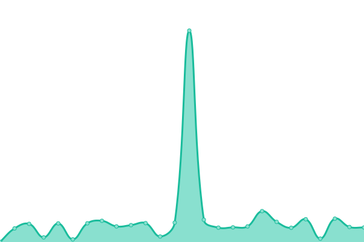

# [📈 Live Status](https://status.rediacc.com): <!--live status--> **🟩 All systems operational**

This repository contains the open-source uptime monitor and status page for [rediacc](https://status.rediacc.com), powered by [Upptime](https://github.com/upptime/upptime).

With [Upptime](https://upptime.js.org), you can get your own unlimited and free uptime monitor and status page, powered entirely by a GitHub repository. We use [Issues](https://github.com/rediacc/upptime/issues) as incident reports, [Actions](https://github.com/rediacc/upptime/actions) as uptime monitors, and [Pages](https://status.rediacc.com) for the status page.

<!--start: status pages-->
<!-- This summary is generated by Upptime (https://github.com/upptime/upptime) -->
<!-- Do not edit this manually, your changes will be overwritten -->
<!-- prettier-ignore -->
| URL | Status | History | Response Time | Uptime |
| --- | ------ | ------- | ------------- | ------ |
|  [Rediacc Main Site](https://www.rediacc.com) | 🟩 Up | [rediacc-main-site.yml](https://github.com/rediacc/upptime/commits/HEAD/history/rediacc-main-site.yml) | 

 151ms
     
 | 

<a href="https://status.rediacc.com/history/rediacc-main-site">100.00%</a>
    

|  [Rediacc Sandbox](https://sandbox.rediacc.com) | 🟩 Up | [rediacc-sandbox.yml](https://github.com/rediacc/upptime/commits/HEAD/history/rediacc-sandbox.yml) | 

 499ms
     
 | 

<a href="https://status.rediacc.com/history/rediacc-sandbox">100.00%</a>
    

|  [Docker Registry](https://registry.rediacc.com/v2/) | 🟩 Up | [docker-registry.yml](https://github.com/rediacc/upptime/commits/HEAD/history/docker-registry.yml) | 

 439ms
     
 | 

<a href="https://status.rediacc.com/history/docker-registry">99.84%</a>
    

|  [License Service](https://lic.rediacc.com) | 🟩 Up | [license-service.yml](https://github.com/rediacc/upptime/commits/HEAD/history/license-service.yml) | 

 771ms
     
 | 

<a href="https://status.rediacc.com/history/license-service">100.00%</a>
    

<!--end: status pages-->

[**Visit our status website →**](https://status.rediacc.com)

## 📄 License

- Powered by: [Upptime](https://github.com/upptime/upptime)
- Code: [MIT](./LICENSE) © [Anand Chowdhary](https://anandchowdhary.com), supported by [Pabio](https://pabio.com)
- Data in the `./history` directory: [Open Database License](https://opendatacommons.org/licenses/odbl/1-0/)
